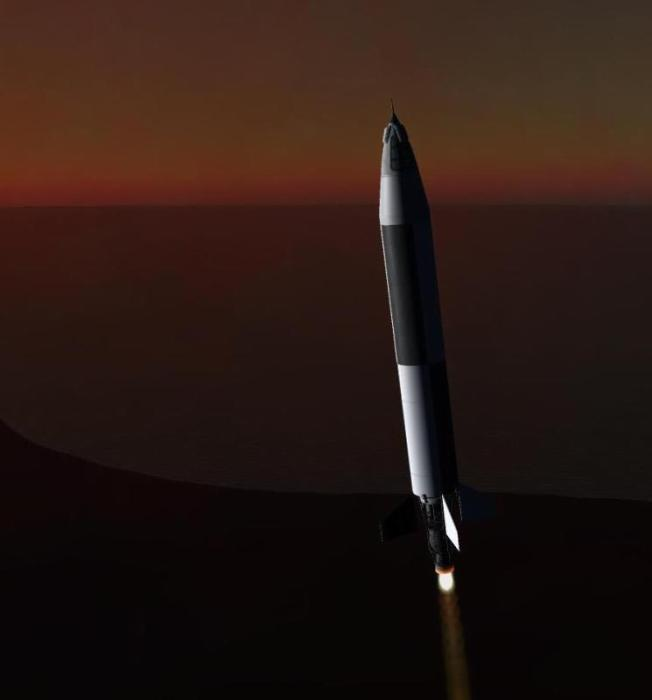

# BraSExI Database

|History                    |[Launch vehicles](lvf.html) |Engines |
|----                       |----                        |----    |
|Major milestones (to add)  |[Booster stages](bsf.html)  |[Atmospheric engines](bef.html)| 
|[Launch history](lpy.html) |[Upper stages](vsf.html)    |[Vacuum engines](vef.html)|

### The encyclopedia of the Brazilian Space Exploration Institute 

Here is a library with the history and achievements of the fledging Brazilian efforts in Space exploration.
This should be updated as we reach higher heights and milestones.

